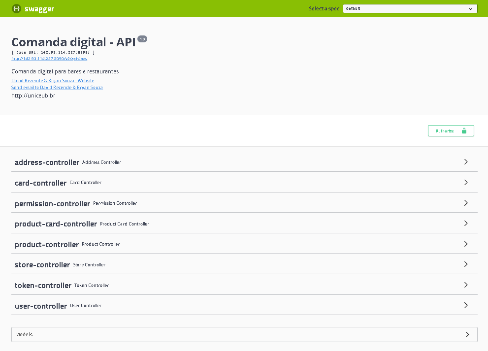
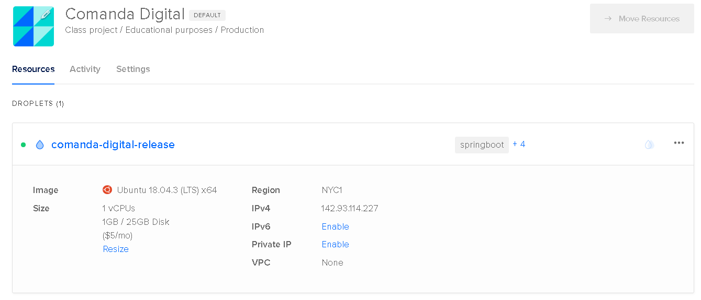

# Comanda Digital API

Trabalho de Conclusão de Curso - UNICEUB  06/2020


***Comando a ser executado junto ao Maven para construir o .jar

```mvn clean package```

## Índice
* Objetivo
* Modelagem
* Documentação da API
* Tecnologia
* Segurança
* Deploy
* Conclusão


## [+] Objetivo

O objetivo com a Comanda Digital API é fornecer endpoints para manipular as principais entidades que estão envolvidas no fluxo trandicional de uma comanda em bares e restaurantes.

## [+] Documentação

[Versão Online SWAGGER Doc - Comanda Digital](http://142.93.114.227:8090/swagger-ui.html#/)



## Deploy

Como solução para hospedar a aplicação na Internet. Hospedamos a API na plataforma Digital Ocean



