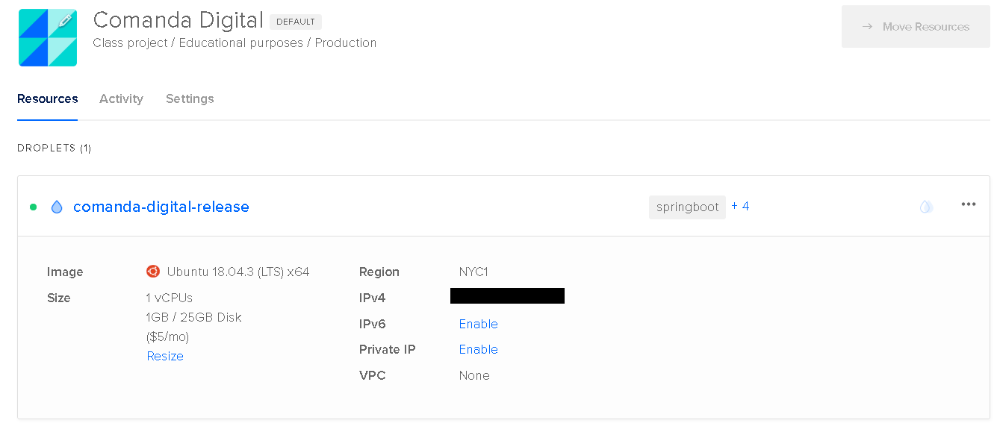

# Comanda Digital API

Trabalho de Conclusão de Curso - UNICEUB  06/2020

***Comando a ser executado junto ao Maven para construir o .jar

```mvn clean package```

```java -jar /home/api/comanda-digital.jar --spring.datasource.username=USERNAME --spring.datasource.password=PASSWORD  --comanda.origin-permitida=http://www.comandadigital.tk --server.port=8090```

## [+] Objetivo

O objetivo da Comanda Digital API é fornecer endpoints para manipular as principais entidades que estão envolvidas no fluxo de uma comanda em bares e restaurantes.

## [+] Scripts - BANCO DE DADOS

Usuários para demonstração em produção:

Administrador: ```usuario: adm@gmail.com; senha: admin```

Estabelecimento: ```usuario: bar@gmail.com; senha: admin```

Cliente: ```usuario: cliente@gmail.com; senha: admin```

[SQL PARA GERAÇÃO DO BANCO DE DADOS](https://github.com/davidrezende/comanda-digital-api/blob/develop/database/sql_tables.sql)

[SQL PARA MASSA DE TESTE](https://github.com/davidrezende/comanda-digital-api/blob/develop/database/sql_inserts.sql)

[SQL PARA MASSA DE TESTE - FATURAMENTO ANUAL](https://github.com/davidrezende/comanda-digital-api/blob/develop/database/sql_insert_year.sql)

## [+] Documentação

[Versão Online SWAGGER Doc - Comanda Digital](http://www.comandadigital.tk:8090/swagger-ui.html#/)


## [+] Deploy

API hospedada na plataforma Digital Ocean.



